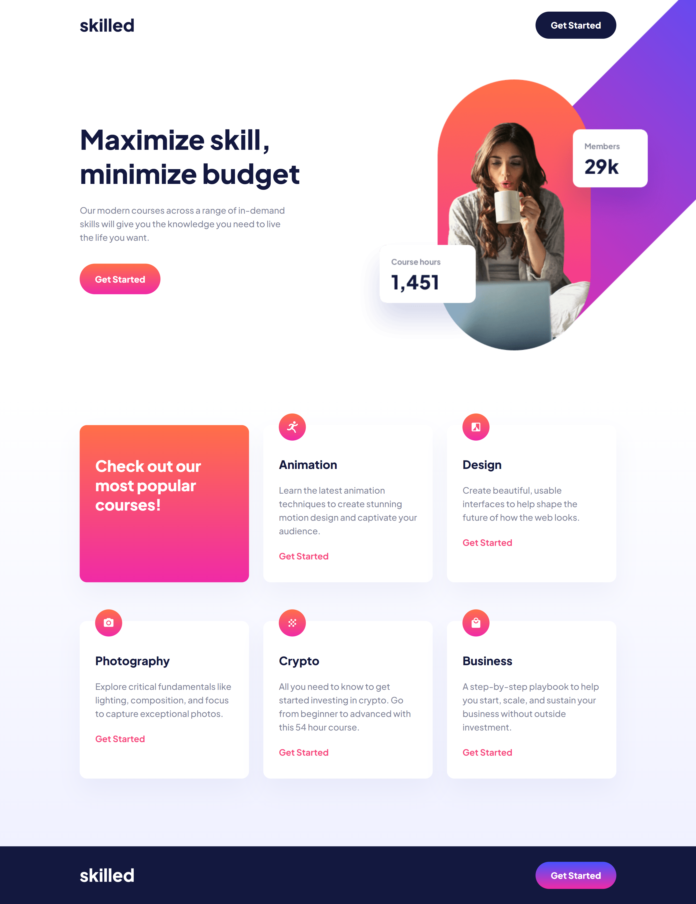

# Frontend Mentor - Skilled e-learning landing page solution

This is a solution to the [Skilled e-learning landing page challenge on Frontend Mentor](https://www.frontendmentor.io/challenges/skilled-elearning-landing-page-S1ObDrZ8q).

## Table of contents

- [Overview](#overview)
  - [Screenshot](#screenshot)
  - [Links](#links)
- [My process](#my-process)
  - [Built with](#built-with)
  - [What I learned](#what-i-learned)
  - [Continued development](#continued-development)
  - [Useful resources](#useful-resources)
- [Author](#author)
- [Acknowledgments](#acknowledgments)

## Overview

### Screenshot
Original Design:

My Solution:

### Links

- [Live URL:](https://ivaberiashvili.github.io/skilled-elearning-landing-page/)

## My process
This was my first "proper" project and yes it took me a lot more than I expected. When things got complex I had to bring in style variables and think about the architecture of my CSS.
Overall, I spent around ~30h on this project, but I consider it well spent as I learned a lot on the side, which will vastly improve my workflow for the next projects.

### Built with

- Semantic HTML5 markup
- CSS custom properties
- Flexbox

### What I learned
- I experienced what I already knew: that the importance of your code's architecture increases with the complexity of the project.
- The most challenging part was working with responsive images, which I did over and over again with different methods in this project and I believe I understood it better.

### Continued development
There are other several other Frontend Mentor projects on my TO-DO list. 
This will probably be my [next project](https://github.com/ivaberiashvili/art-gallery-website).

### Useful resources

- [Mdn Web Docs > CSS](https://developer.mozilla.org/en-US/docs/Web/CSS/background) - This is extremely helpful resource with real time examples.

## Author

- [Iva](https://github.com/ivaberiashvili)

## Acknowledgments

Many thanks to my mentors: [Otar Zakalashvili](https://github.com/otarza) and [Beka Zandukeli](https://github.com/bekazandukeli) for helping me along the way. 
